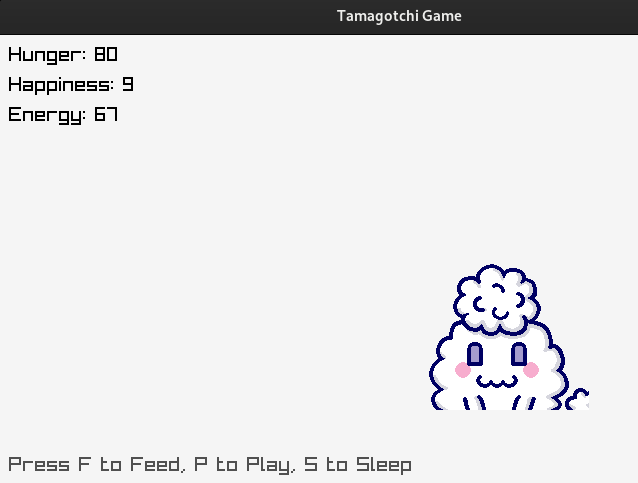

# Tamagotchi

A simplified version of the classic game in C.  

  
  
Spritesheet from:  
https://www.spriters-resource.com/lcd_handhelds/tamagotchipix/sheet/221972/
  
To compile:

```
gcc -o tama tama.c -lraylib -lGL -lm -lpthread -ldl -lrt -lX11
```
